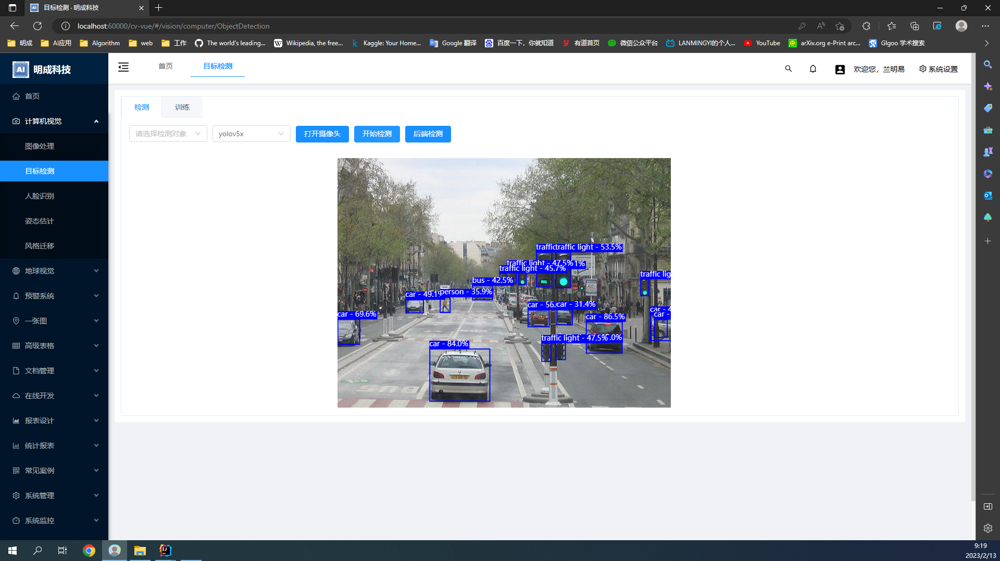
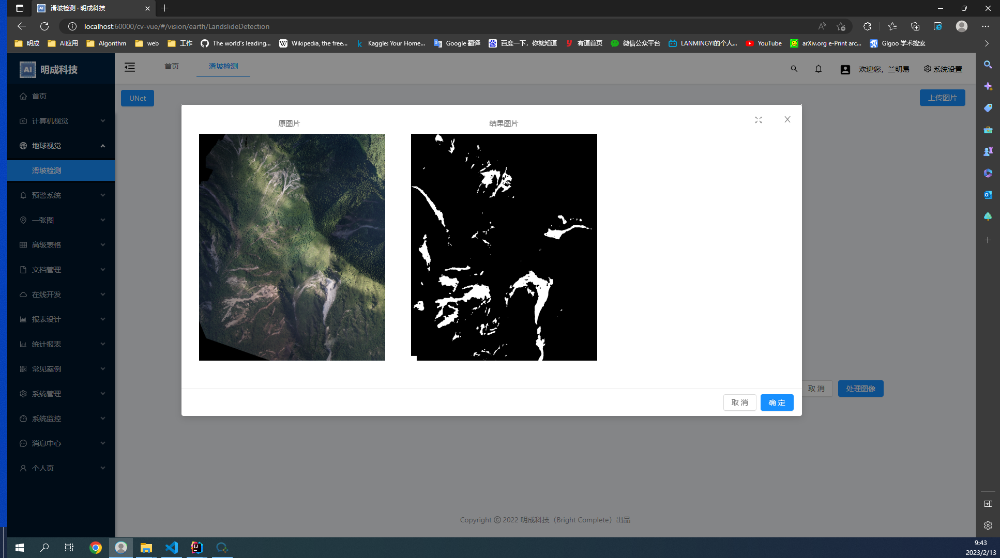

明成科技 （BrightComplete） 计算机视觉开发平台
====

当前研发版本： 1.0.0（发布日期：20240101）


Overview
----

前端


> 强大的计算机视觉开发平台，既能快速提高效率，节省成本，同时又不失灵活性

## 项目源码

| 仓库 | 前端源码 | 后端源码 | 算法源码 |

| github | [web](https://github.com/lanmingyi/web)  | [server](https://github.com/lanmingyi/server) |
[algorithm](https://github.com/lanmingyi/algorithm) |

##### 项目说明

| 项目名            | 说明       | 
|----------------|----------|
| `web`          | vue3前端   | 
| `server`       | java后台   | 
| `algorithm` | python算法 | 

#### 项目功能

- 计算机视觉
- 地球视觉
- 预警系统
- 一张图
- 高级表格
- 文档管理
- 在线开发
- 报表设计
- 统计报表
- 常见案例
- 系统管理
- 系统监控
- 消息中心

详细介绍
-
<p align="center">
<b>计算机视觉</b><br>
<table align="center">
<tr>
	<td align="center"><br>图像处理</td>
	<td align="center"><br>目标检测</td>
</tr>
<tr>

[//]: # (	<td align="center"><br>人脸识别</td>)

  <td align="center"><br>姿态估计</td>
  <td align="center"><br>风格迁移</td>
</tr>
</table>
</p>

<p align="center">
<b>地球视觉</b><br>
<table align="center">
<tr>
	<td align="center"><br>滑坡检测</td>
</tr>

</table>
</p>


技术支持
----

遇到问题可在项目上提[Issues](https://github.com/lanmingyi/web/issues/new)

官方支持：


项目下载和运行
----

- 拉取项目代码

```bash
git clone git@github.com:lanmingyi/web.git
cd  web
```

- 安装依赖
```
npm install
或 yarn install
```

- 开发模式运行
```
npm run dev 
或 yarn run dev
```

- 编译项目
```
npm run build
或 yarn run build
```

[//]: # (Docker镜像启动前端)

----


其他说明
----

```ecmascript 6

```

附属文档
----


- 待补充...

备注
----
> 


