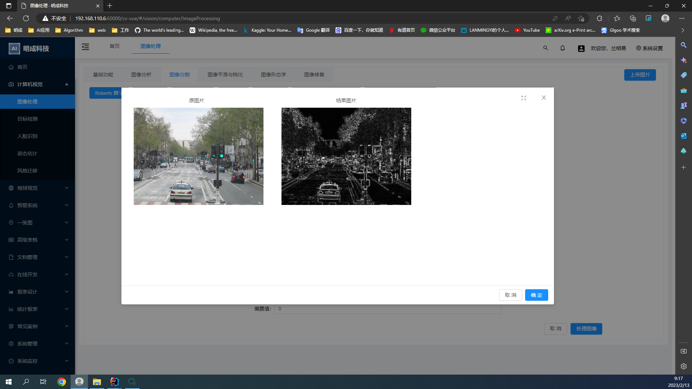
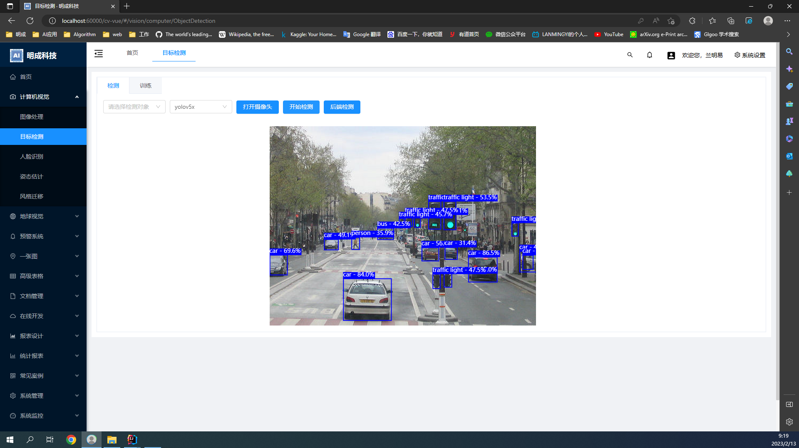
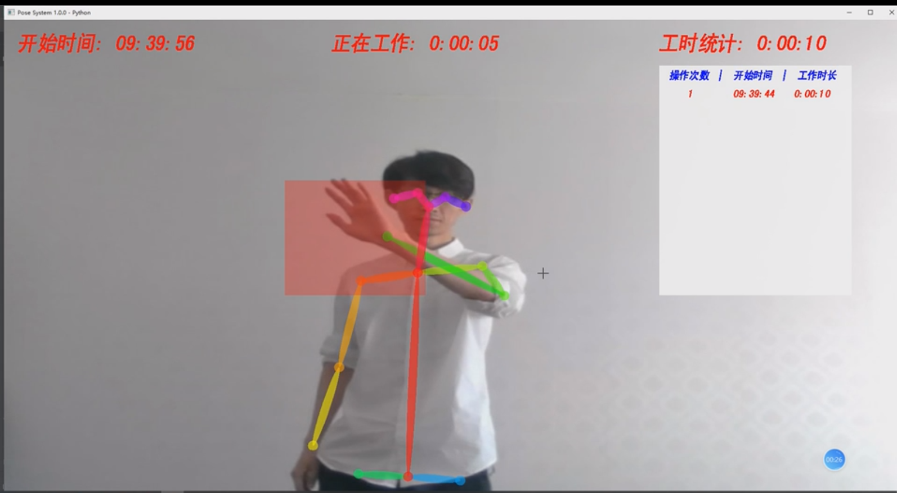
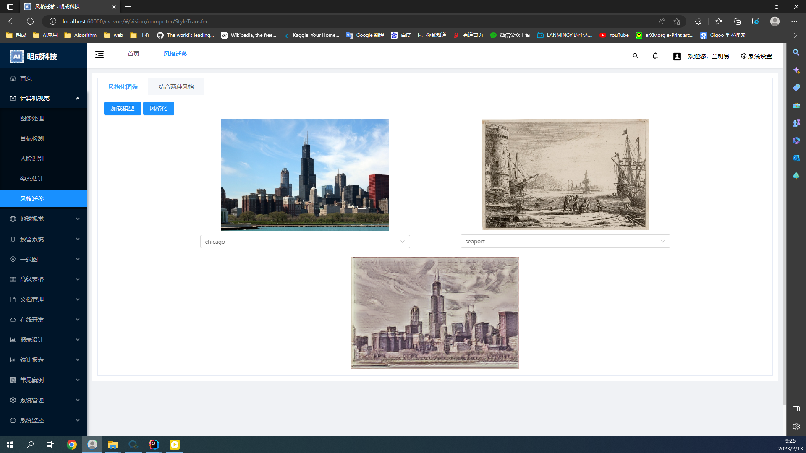
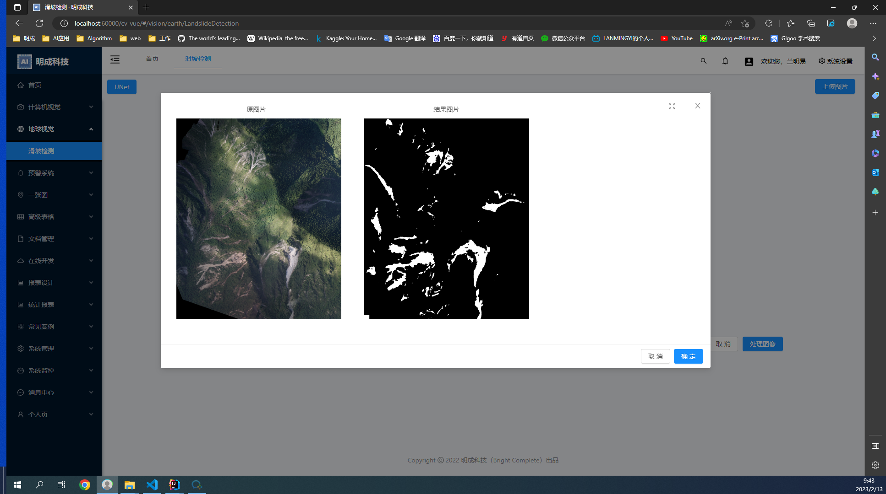

明成科技 （BrightComplete） 计算机视觉开发平台
====

当前研发版本： 1.0.0（发布日期：20230205）


Overview
----

前端


> 强大的计算机视觉开发平台，既能快速提高效率，节省成本，同时又不失灵活性

## 项目源码

| 仓库 | 前端源码 | 后端源码 | 算法源码 |

| github | [cv-vue](https://github.com/lanmingyi/cv-vue)  | [cv-spring](https://github.com/lanmingyi/cv-spring) |
[cv-algorithm](https://github.com/lanmingyi/cv-algorithm) |

##### 项目说明

| 项目名            | 说明       | 
|----------------|----------|
| `cv-vue`       | vue前端    | 
| `cv-spring`    | java后台   | 
| `cv-algorithm` | python算法 | 

#### 项目功能

- 计算机视觉
- 地球视觉
- 预警系统
- 一张图
- 高级表格
- 文档管理
- 在线开发
- 报表设计
- 统计报表
- 常见案例
- 系统管理
- 系统监控
- 消息中心

详细介绍
-
<p align="center">
<b>计算机视觉</b><br>
<table align="center">
<tr>
	<td align="center"><br>图像处理</td>
	<td align="center"><br>目标检测</td>
</tr>
<tr>

[//]: # (	<td align="center"><br>人脸识别</td>)

  <td align="center"><br>姿态估计</td>
  <td align="center"><br>风格迁移</td>
</tr>
</table>
</p>

<p align="center">
<b>地球视觉</b><br>
<table align="center">
<tr>
	<td align="center"><br>滑坡检测</td>
</tr>

</table>
</p>


[//]: # (<p align="center">)

[//]: # (<b>Mergin in <a href="https://inputapp.io/">Input app</a></b><br>)

[//]: # ()

[//]: # (</p>)


技术支持
----

遇到问题可在项目上提[Issues](https://github.com/lanmingyi/cv-vue/issues/new)

官方支持：


项目下载和运行
----

- 拉取项目代码

```bash
git clone git@github.com:lanmingyi/cv-vue.git
cd  cv-vue
```

- 安装依赖

```
yarn install
或 npm install
```

- 开发模式运行

```
yarn run serve
或 npm run serve
```

- 编译项目

```
yarn run build
或 npm run build
```

- Lints and fixes files

```
yarn run lint
```

[//]: # (Docker镜像启动前端（单体模式）)

[//]: # (----)


其他说明
----

- 关闭 Eslint (不推荐) 移除 `package.json` 中 `eslintConfig` 整个节点代码

- 修改 Ant Design 配色，在文件 `vue.config.js` 中，其他 less
  变量覆盖参考 [ant design](https://ant.design/docs/react/customize-theme-cn) 官方说明

```ecmascript 6
  css: {
  loaderOptions: {
    less: {
      modifyVars: {
        /* less 变量覆盖，用于自定义 ant design 主题 */

        'primary-color'
      :
        '#F5222D',
          'link-color'
      :
        '#F5222D',
          'border-radius-base'
      :
        '4px',
      }
    ,
      javascriptEnabled: true,
    }
  }
}
```

附属文档
----

- [Vue](https://cn.vuejs.org/v2/guide)

- [Ant Design Vue](https://vuecomponent.github.io/ant-design-vue/docs/vue/introduce-cn)

- 其他待补充...

备注
----
更新下mini-css-extract-plugin版本，
npm i -D mini-css-extract-plugin@2.3.0
可使用npm install + npm run build
> 


